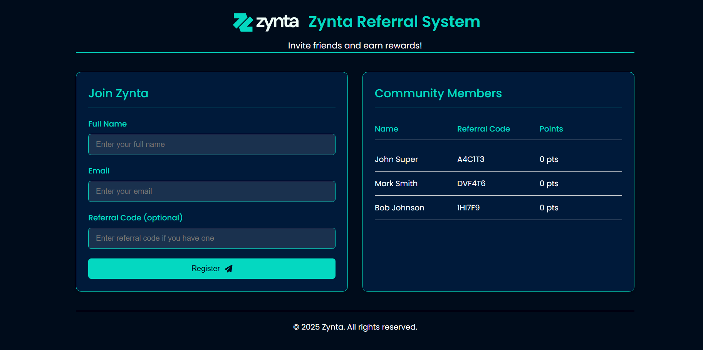

# Zynta Referral System

A simple referral system with backend (Node.js/Express) and frontend (HTML/CSS/JavaScript) components.


## Features

- User registration with name and email
- Unique referral code generation
- Referral points system (10 points per successful referral)
- View all registered users
- Responsive design with Zynta branding

## Setup Instructions

### Backend Setup

1. Navigate to the `backend` directory:
    ```bash
    cd backend
    ```
2. Install dependencies:
    ```bash
    npm install
    ```
3. Build:
    ```bash
    npm run build
    ```
4. Start the server:
    ```bash
    npm run start
    ```
    The backend will run on [http://localhost:3000](http://localhost:3000).

### Frontend Setup

1. Open the `frontend/index.html` file in a web browser.

    The frontend will automatically connect to the backend at [http://localhost:3000](http://localhost:3000).

## Usage

1. Fill out the registration form with your name and email.
2. Optionally, enter a referral code if you were referred by someone.
3. Click **Register** to create your account.
4. Your unique referral code will be generated automatically.
5. Share your referral code with friends to earn points.

## API Endpoints

- `GET /api/users` — Get all users
- `POST /api/register` — Register a new user
- `GET /api/users/:referralCode` — Get user by referral code

